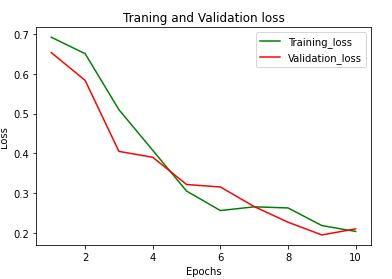
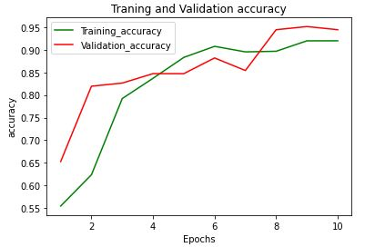
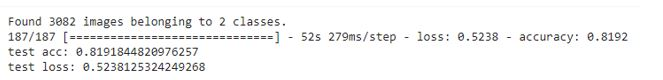
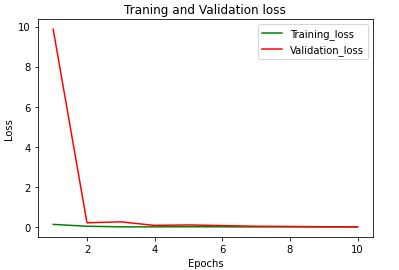
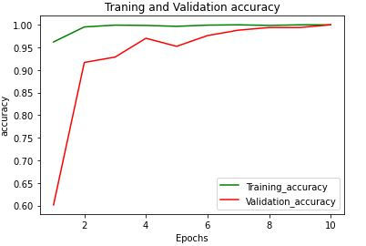
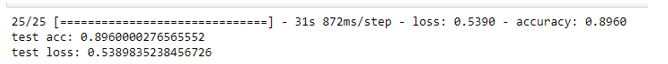
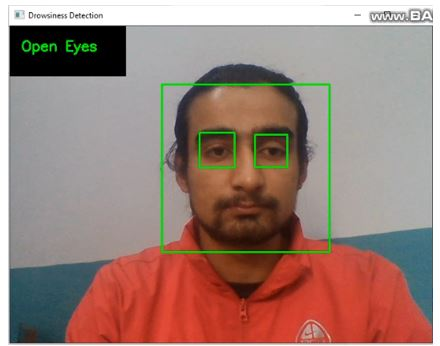
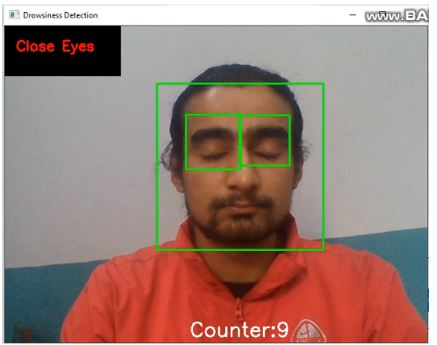
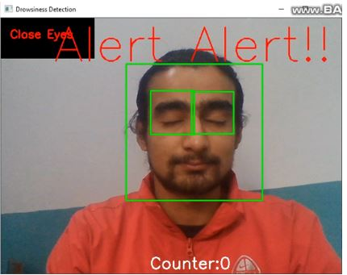

<h3>Driver Drowsiness Detection System</h3>

<h2>Introduction</h2>
 The project is fully based on AI and lies in the field of computer vision and Machine learning. The project focuses to capture the real-time drowsy state of driver through the eyes state the dataset for building the model will be the images of eyes which is categorized into open eyes dataset and close eyes dataset. The model is built by training the open/close eyes images so the project is based on supervised learning and to build the model CNN (Convolution Neural Network) algorithm is used as it works better than other algorithm as the dataset are the set of images. 
 A camera is placed in front of the driver that processes the images frames from the video and with the Voila Jones algorithm it detects the face structure and with the haar cascade eye classifier we can able to detect the ROI i.e. eyes After extracting the eyes from the video the image is feed to the CNN model and the model identify whether the eyes are open or closed. And if the eyes are closed for a certain frames the alarm is buzzed. If the user close the eyes the counter value appears in the frame starting from 10 and if the user continuously close the eyes the counter value decrease and reaches to 0 and the alarm buzzed to alert the driver showing alert message on the screen. 

<h2>Aims of the project</h2>
 * Developing a face detection system. 
 * Extracting the facial region especially eyes. 
 * Developing the drowsiness detection system through eye closure/blink. 
 * Developing a complete web based application 

<h2>Datasets</h2>
 I have taken the dataset from “MRL Eye Dataset”. The dataset consists the total images of 84,898 with the data of total 37 different persons 4 women and 33 men. The dataset images are low and high resolution and all are captured in different lighting conditions. This dataset was really developed to detect the pupil of the eyes but for the project the dataset is used for training the CNN model to differentiate between open and close eyes. 

<h2>Building a Model</h2>
 For this project to build the model 2 different approaches and technique are considered and among them best technique is finalized and consider as a real model. The two approaches are: 
 * Building the model by own 
 * Using the concept of transfer learning 

<h1>Building the model by own</h1>
 Here first the dataset is prepared and split into training, validation and testing. About 17000 images are considered and out of that about 12000 images are taken for testing, about 2000 images are taken for validation and about 3000 images for testing the model. After that total three folder is created for training, validation and testing and in each of the folder again two sub folder is created as Open Eyes where all open eyes image are placed and other Close Eyes where all close eyes image are placed and the process to make model start. After running about 10 epoch the model get the accuracy of 93% on training data while 94% on validation data which is good as it was able to identify between open and close eyes. But it got only 81% on testing data. 

    

<h1>Using the concept of Transfer Learning</h1>
 For the second approach I have used the concept of transfer learning to create the model. Transfer learning means to transfer the knowledge of already pertained model to the model we are going to build. This technique is used to see if transfer learning technique performs better than the model we created. As we are going to use pre trained model we didn’t use many images to build our model For this model only 1672 images are taken for training, and 500 images for testing for validation I have used 10% data out of 1672 training images. We can take small amount of data and can build the model with higher accuracy and testing accuracy. For this the same above process is repeat and two folder namely training and testing is created and inside each of them again sub folder open eyes and close eyes are created. Open eyes images are placed in open eyes folder and close eyes image are taken into close eyes folder. After running about 10 epoch the model get the accuracy of 100% on training data as well 100% on validation data which is good as it was able to identify between open and close eyes. But it got only 89.66% on testing data i.e. about 90% which is better than above model.   

     

<h1>MobileNet Architecture</h1>
 While using the concept of transfer learning MobileNet architecture is used
MobileNets models is the efficient models used for embedded vision applications. It is the streamlined architecture which uses depth wise separable convolutions in the network to build the light weight deep neural networks. The main objective of the mobilenet architecture is to make the model lighter using less parameters and not decreasing the accuracy significantly. 

<h1>Metrices</h1>
  <b>Confusion Matrix </b>  
 
 The above figure is the confusion matrix from the model which uses the technique of transfer learning. Two classes i.e. open and close eyes includes 250 images each with the total of 500 testing images. From the above confusion matrix we can say that from 250 images in the close eyes the model successfully classify the images as close eyes is 226 we can also say it has the True Negative (TN) while the model predict 24 images as wrong prediction i.e. it predict the close eyes images as open eyes can be called as False Positive (FP). Again for the open eyes we can analyze the model successfully predict 222 images as open eyes can be called as True Positive (TP) while it predict 28 of the images as wrong prediction i.e. it predict open eyes image as close eyes image can also be called as False Negative (FN). 

<h1>Deployment of model</h1>
 While deploying model in the web application the trained CNN model is saved by h5 extension and is loaded in the django framework directly. There’s no use of API while deploying the model in web application as it works perfectly while directly loading the h5 extension file in the django framework. 

<h1>Results after deploying in Django Framework</h1>

     

     

 As the user must register first to access into the system and after registering the user should provide a valid email and the user get the link in their email and only after verifying the user can login as they cannot login into the system if the he/she doesn’t verify the mail as shown in the above figure. After verifying the user get into the system and when the user click on the button ‘Open Camera’ the new window will appear and detects the face and eyes of the user. If the eyes are in open state in the top left window the text ‘Open Eyes’ with green colour appear and while the user closes the eyes the text ‘Close Eyes’ appear. And if the user continuously closes the eyes for certain frames the counter value strat decreasing from 10,9… and when it reaches 0 the ‘Alert Alert!!’ text with red color appear in the middle of the window and the alarm is buzzed until user open the eyes.    

